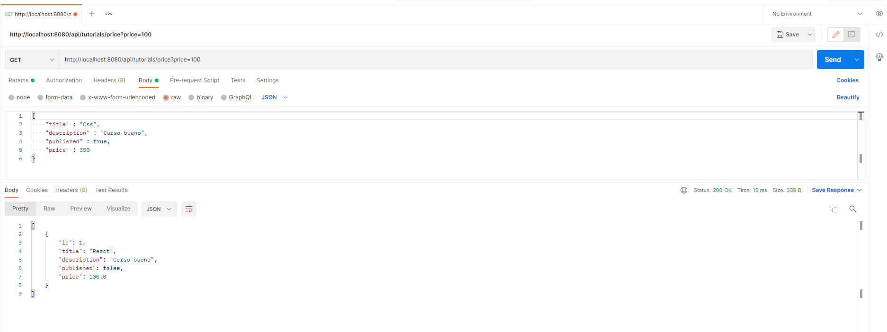
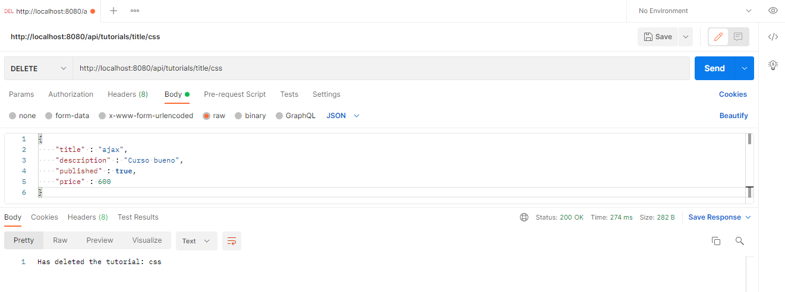
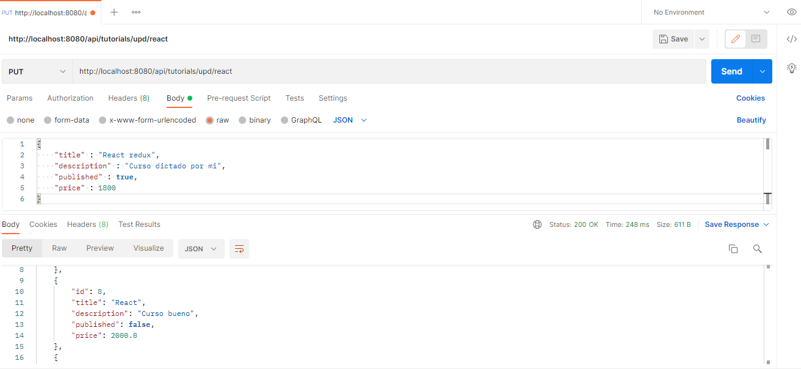
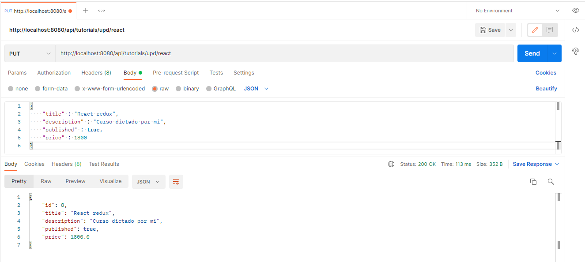

# Spring Boot JPA MySQL - Building Rest CRUD API example
"# API-rest-FULL-Tutorials" 

### Se añade método para buscar por precio

### Se añade método para eliminar tutorial por título

### Se añade método para actualizar tutorial por titulo

